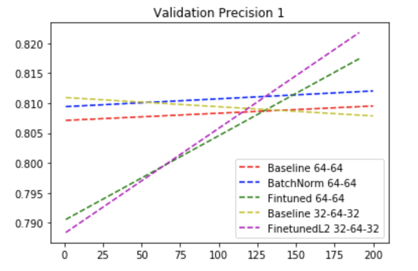
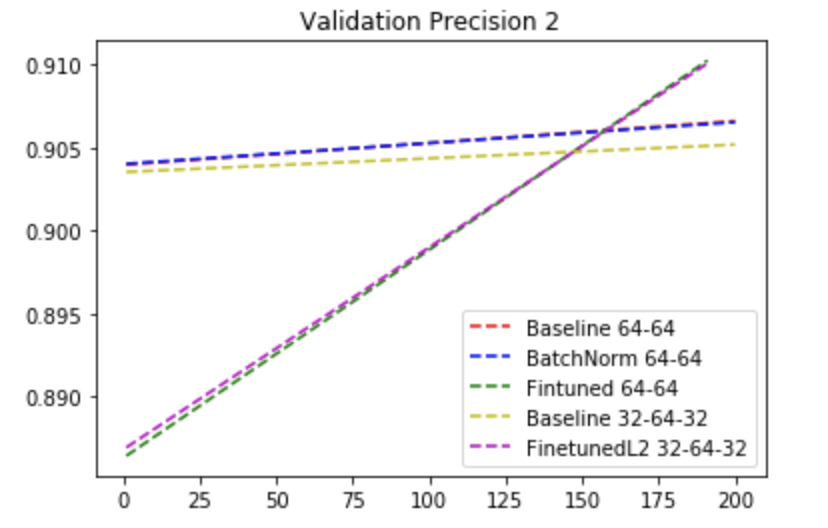
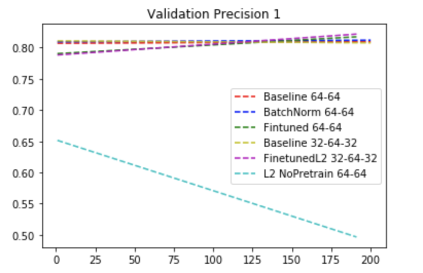
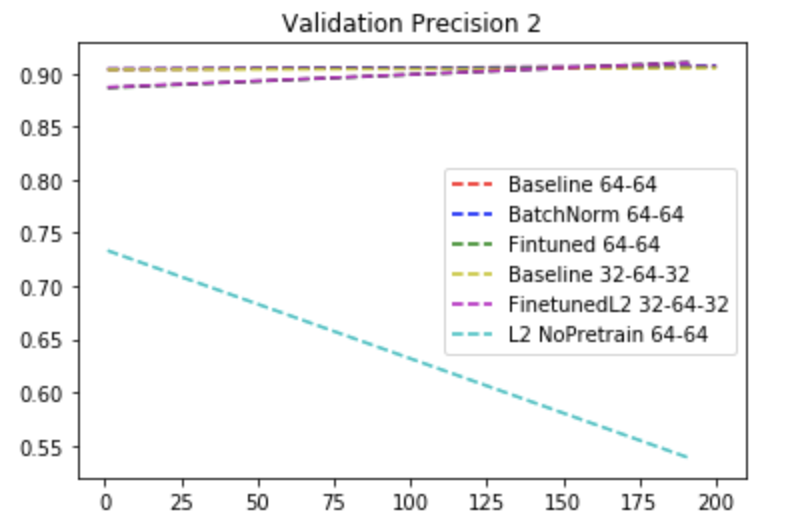
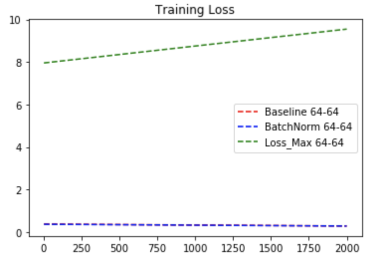
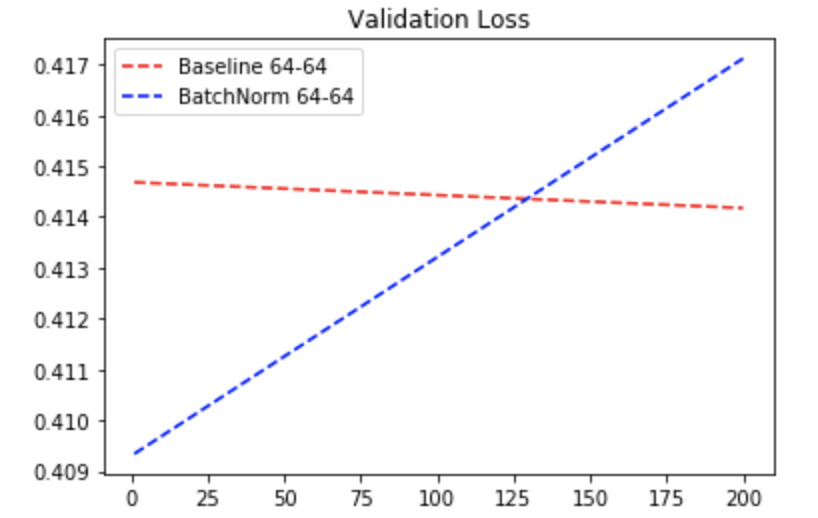
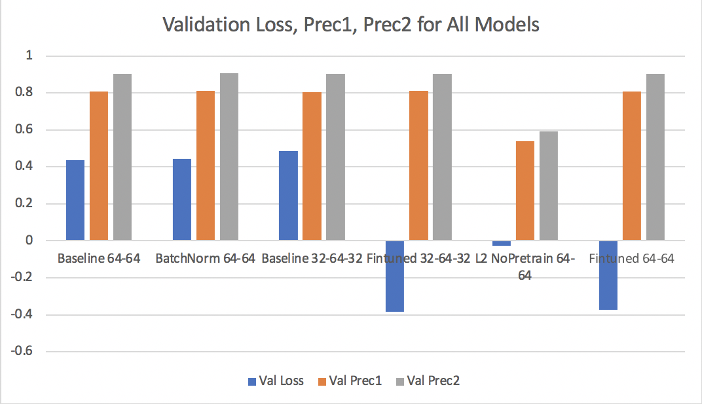

# GANUserModel-DLS2020
This repo contains the source codes used for my final project in the class "Introduction to Deep Learning System". 

## Overview

The project is a [TensorFlow 2.4.0-rc4](https://github.com/tensorflow/tensorflow/releases/tag/v2.4.0-rc4) implementation of the GAN-based user models proposed in the paper [Generative Adversarial User Model for Reinforcement Learning Based Recommendation System](http://proceedings.mlr.press/v97/chen19f/chen19f.pdf), by Chen et al. The implementation is then tested on the [Retailrocket recommender system dataset](https://www.kaggle.com/retailrocket/ecommerce-dataset).


## Getting Started

To reproduce results of this project:

1. make sure Tensorflow >=  v2.4.0-rc4 has been [installed](https://www.tensorflow.org/install)

2. install the user model package `ganrl-tfv2` with `pip install -e`

3. download data set from [this link](https://www.kaggle.com/retailrocket/ecommerce-dataset). 

4. download the notebook "data_processing.ipynb" and extract data needed (experiment did not use the complete data set due to hardware constraints). 

5. place the select data under the folder `./dropbox` and run `./process_data.sh` to get the serialized pickle files

   

## Run Models

Simply run in terminal:

```
cd ganrl-tfv2/experiment_user_model/
./run_gan_user_model.sh
```

For more details regarding options for model configuration, check the  `./common/cmd_args.py`.


## Performance Evaluation

Fine-tuning the reward model in an adversarial way helps increase generalizability of the resulting model




Pre-training with Shannon Entropy is essential for model convergence. We can see the result deterioated dramatically with the "no pretrain" model.



Skipping Pre Training Leads to not only bad generalizability but convergence.


Adding batchnormalization layers worsen convergence


Finally, let's compare the final test results of all models

- Pre-training with Shannon Entropy helps reduce instability in the training process of our GAN user models and leads to better validation scores.
- Directly training the user models adversarially lead to instability in the training process, potential divergence, and bad generalization results.
- Models trained using Shannon Entropy improves slowly; however,  fine-tuning adversarially afterwards would restart the progression and obtain better result.

